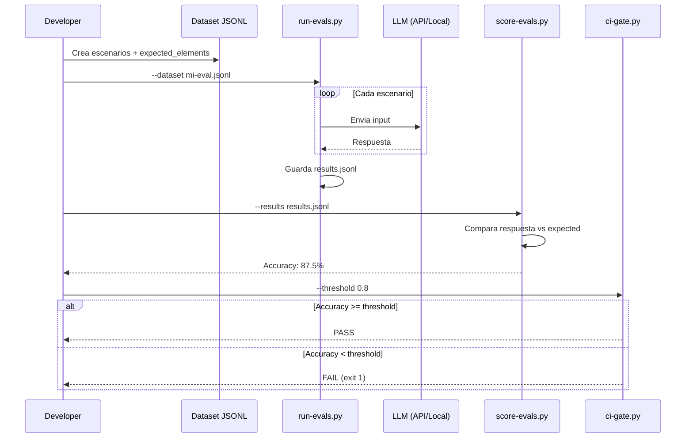

# Tier 2: Eval — Verificacion y calidad

## Por que importan los eval datasets

Tu agente dice "listo". Pero, lo esta realmente?

Los eval datasets son conjuntos de preguntas con respuestas esperadas. Ejecutas el agente contra ellos y mides cuantas respuestas son correctas. Sin eval datasets, solo tienes la palabra del agente.

## Como funciona



## Formato de eval dataset

Cada linea del archivo JSONL es un escenario:

```json
{
  "id": "SC-001",
  "input": "Tu prompt dice 'haz algo con este texto'. Que falla?",
  "expected_elements": ["identificar ambiguedad", "anadir objetivo especifico"],
  "difficulty": "basico",
  "tags": ["prompting", "claridad"]
}
```

- `id`: identificador unico
- `input`: el escenario o pregunta
- `expected_elements`: array de elementos que la respuesta debe contener
- `difficulty`: basico, intermedio, avanzado
- `tags`: categorias para filtrar

## Como crear tu propio dataset

1. Identifica el dominio de tu agente (que tipo de tareas hace)
2. Escribe 8 escenarios que cubran casos basicos, intermedios y avanzados
3. Para cada escenario, define que elementos debe contener una buena respuesta
4. Guardalo como JSONL en `eval/datasets/`
5. Usa `eval/templates/eval-dataset.jsonl` como referencia

## Como ejecutar evals

```bash
# 1. Ejecutar evals contra un LLM
python3 eval/runners/run-evals.py \
  --dataset eval/datasets/prompting-basics.jsonl \
  --output results.jsonl \
  --provider anthropic \
  --model claude-sonnet-4-6

# 2. Scoring automatico
python3 eval/runners/score-evals.py \
  --results results.jsonl \
  --mode simple

# 3. Gate para CI
python3 eval/runners/ci-gate.py \
  --results results.jsonl \
  --threshold 0.8
```

## Rubrica de evaluacion

Usa `eval/templates/rubric.md` para evaluaciones manuales. 6 dimensiones, puntuacion 0-12.

## Datasets incluidos

| Dataset | Escenarios | Dominio |
|---------|-----------|---------|
| prompting-basics.jsonl | 8 | Fundamentos de prompting |
| agent-reliability.jsonl | 8 | Fiabilidad de agentes IA |
| automation-workflows.jsonl | 8 | Automatizacion y workflows |
| code-quality.jsonl | 8 | Calidad de codigo |

## Empezar

1. Elige un dataset existente o crea el tuyo
2. Ejecuta `run-evals.py` con tu modelo
3. Revisa resultados con `score-evals.py`
4. Itera: anade escenarios donde el agente falla

## Mas informacion

- [IAcademy M07: Observabilidad y calidad](https://iacademy.es/course/m07) — Eval datasets, quality gates
- [Patron: agent-testing](../patterns/agent-testing.md) — Shadow, canary, eval pipeline
