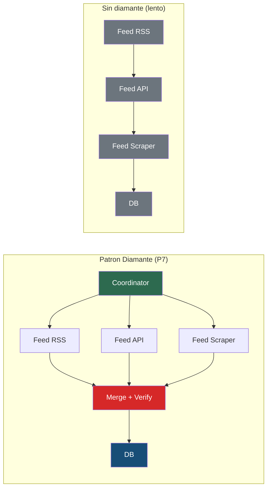

# Graph Engineering: 14 patrones para sistemas multi-agente

## El problema

Tienes un pipeline con multiples agentes o pasos. Funciona, pero:
- Pasos independientes corren en secuencia (lento)
- Un fallo en un paso tumba todo el pipeline
- No sabes si los resultados son fiables (nadie verifica)
- Usas el modelo mas caro para todo (caro)

## Los 14 patrones

Graph Engineering trata tu pipeline como un grafo: nodos (unidades de trabajo) conectados por aristas (flujos de datos). Optimizas el grafo eliminando aristas falsas, paralelizando y verificando.

### P1: Nodos y aristas claros

Cada unidad de trabajo tiene entrada y salida definida. Si no puedes dibujar el grafo, no lo entiendes.



**Test:** para cada paso, puedes escribir su input/output como JSON schema?

### P2: Borrar aristas falsas

Una arista falsa es un "y luego" que no transporta datos. Los pasos son secuenciales por costumbre, no por necesidad.

```
# MAL: secuencial sin motivo
resultado_imagenes = generar_imagenes(guion)
resultado_audio = generar_audio(guion)  # No depende de imagenes!

# BIEN: paralelo
import concurrent.futures
with concurrent.futures.ThreadPoolExecutor() as executor:
    f_img = executor.submit(generar_imagenes, guion)
    f_audio = executor.submit(generar_audio, guion)
    resultado_imagenes = f_img.result()
    resultado_audio = f_audio.result()
```

**Test:** para cada paso secuencial, pregunta: "el paso B lee la salida del paso A?" Si no, es arista falsa.

### P3: Contratos schema

Cada nodo tiene un schema tipado de entrada y salida. Sin contratos, los nodos se acoplan por convencion invisible.

```python
from pydantic import BaseModel

class FeedInput(BaseModel):
    url: str
    feed_type: str  # "rss" | "api" | "scraper"

class FeedOutput(BaseModel):
    items: list[dict]
    source: str
    fetched_at: str
```

### P4: Aristas como codigo

Las transformaciones entre nodos son codigo determinista, no agentes. Si puedes hacerlo con un `map()` o un regex, no uses LLM.

```python
# MAL: LLM para transformar formato
respuesta = llm("convierte este JSON a CSV")

# BIEN: codigo
import csv
csv_output = [dict_to_row(item) for item in items]
```

### P5: Fan-out (parallel)

Trabajos independientes corren en paralelo. Es el patron con mayor impacto inmediato.

```python
# Celery
from celery import group
result = group(
    process_feed.s(feed) for feed in feeds
).apply_async()

# asyncio
results = await asyncio.gather(
    process_feed(feed) for feed in feeds
)

# ThreadPoolExecutor
with ThreadPoolExecutor(max_workers=4) as pool:
    results = list(pool.map(process_feed, feeds))
```

**Impacto tipico:** ingesta de 15 min → 2 min. Video pipeline de 8 min → 5 min.

### P6: Barreras justificadas

Una barrera espera a que TODOS los resultados del fan-out esten listos. Solo usala cuando necesitas el conjunto completo para el siguiente paso.

```python
# BARRERA necesaria: verificacion cruzada necesita todos los IOCs
all_iocs = await asyncio.gather(*feed_tasks)
verified = cross_verify(all_iocs)  # Necesita el conjunto completo

# BARRERA innecesaria: cada resultado se puede procesar independiente
# MAL:
all_results = await asyncio.gather(*tasks)
for r in all_results:
    save_to_db(r)

# BIEN: pipeline (cada resultado fluye sin esperar al resto)
for task in tasks:
    result = await task
    save_to_db(result)
```

### P7: Patron diamante

Parte → paralelo → fusiona. El patron mas potente para pipelines de datos.

```
        ┌→ [Feed RSS]  →┐
[Input] →→ [Feed API]  →→→ [Merge + Verify] → [Output]
        └→ [Feed Scraper]→┘
```

```python
# Celery chord (diamante real)
from celery import chord
chord(
    group(process_feed.s(f) for f in feeds),
    merge_and_verify.s()
).apply_async()
```

### P8: Router modelo + codigo

El modelo clasifica. El codigo enruta. Nunca dejes que el modelo decida la ruta.

```python
# MAL: el modelo decide
respuesta = llm("Decide si esto es critico y que hacer")

# BIEN: el modelo clasifica, el codigo enruta
severity = llm("Clasifica severity: critical/warning/info")
if severity == "critical":
    alert_oncall(data)
elif severity == "warning":
    create_ticket(data)
else:
    log_info(data)
```

### P9: Verificacion adversarial

Un verificador independiente intenta "matar" los hallazgos del nodo principal. Reduce falsos positivos dramaticamente.

```python
def verify_ioc_confidence(iocs: list[dict]) -> list[dict]:
    """Verificacion cruzada: 2+ feeds = high, 1 feed = medium."""
    for ioc in iocs:
        sources = count_sources(ioc["value"])
        if sources >= 2:
            ioc["confidence"] = "high"
        elif has_known_family(ioc["value"]):
            ioc["confidence"] = "medium"
        else:
            ioc["confidence"] = "low"
    return iocs
```

**Regla:** verifica con codigo primero. LLM como verificador solo si el codigo no puede.

### P10: Aislamiento de fallos

Un fallo en un nodo no cascadea al resto. Cada nodo tiene su propio error handling.

```python
# MAL: un feed falla, todos fallan
for feed in feeds:
    process_feed(feed)  # Si falla, los siguientes no se ejecutan

# BIEN: cada feed aislado
results = []
for feed in feeds:
    try:
        results.append(process_feed(feed))
    except Exception as e:
        log_error(f"Feed {feed.name} fallo: {e}")
        # Continua con los demas
```

Combinado con fan-out (P5): `asyncio.gather(*tasks, return_exceptions=True)`

### P11: Ciclos convergentes

Los bucles tienen tope de rondas y dedupe contra todo lo visto. Sin esto, los ciclos explotan.

```python
MAX_ROUNDS = 3
seen = set()

for round_num in range(MAX_ROUNDS):
    new_items = discover(seeds) - seen
    if not new_items:
        break  # Convergencia: no hay nada nuevo
    seen.update(new_items)
    seeds = new_items  # Siguiente ronda busca desde los nuevos
```

**Regla:** max 3 rondas. Profundidad > 3 genera > 60% ruido.

### P12: Model tiering

Modelo barato para tareas repetitivas. Modelo caro para criterio.

```python
# Clasificacion (repetitiva, alta frecuencia) → modelo barato
category = haiku("Clasifica: bug/feature/question")  # $0.001

# Analisis (criterio, baja frecuencia) → modelo caro
analysis = opus("Analiza la causa raiz de este incidente")  # $0.20
```

| Tarea | Modelo | Coste |
|-------|--------|-------|
| Clasificar, extraer, formatear | Haiku / Phi-4 | ~$0.001 |
| Generar, analizar, sintetizar | Sonnet / Qwen3.5 | ~$0.02 |
| Razonar, decidir, arquitectar | Opus | ~$0.20 |

Ver tambien: [model-routing.md](model-routing.md)

### P13: Pipeline vs barrera

Pipeline por defecto: cada resultado fluye al siguiente paso sin esperar al resto. Barrera solo cuando necesitas el conjunto completo.

```python
# PIPELINE (defecto): procesa cada item al llegar
async for item in stream_feed(feed):
    enriched = enrich(item)
    await save(enriched)

# BARRERA (excepcion): necesita todo para verificar cruzado
all_items = [item async for item in stream_feed(feed)]
verified = cross_verify(all_items)
```

### P14: Workflows dinamicos

Workflows guardados como archivos reutilizables. No reinventar el pipeline cada vez.

```javascript
// .claude/workflows/cti-daily-brief.js
// Ejecutable: claude workflow run cti-daily-brief
const steps = [
  "Leer ultimas 24h de alertas via API",
  "Clasificar por severity",
  "Generar brief ejecutivo",
  "Enviar via Telegram"
]
```

## Checklist rapido

Antes de deploy, verifica:

- [ ] Puedo dibujar el grafo de nodos y aristas? (P1)
- [ ] Hay pasos secuenciales que no dependen entre si? (P2)
- [ ] Cada nodo tiene input/output tipado? (P3)
- [ ] Las transformaciones son codigo, no LLM? (P4)
- [ ] Los trabajos independientes corren en paralelo? (P5)
- [ ] Las barreras estan justificadas? (P6)
- [ ] Existe algun diamante (parte→paralelo→merge)? (P7)
- [ ] El modelo clasifica y el codigo enruta? (P8)
- [ ] Hay verificacion independiente de resultados? (P9)
- [ ] Un fallo en un nodo no tumba el resto? (P10)
- [ ] Los ciclos tienen max rondas y dedupe? (P11)
- [ ] Modelo barato para repetitivo, caro para criterio? (P12)
- [ ] Pipeline por defecto, barrera por excepcion? (P13)
- [ ] Workflows guardados y reutilizables? (P14)

## Scoring

```
Score = media ponderada de los 14 patrones (0-100)
  Peso x3: P5 (fan-out), P9 (verificacion), P10 (aislamiento)
  Peso x2: P3 (contratos), P7 (diamante), P12 (model tiering)
  Peso x1: resto
```

| Color | Score | Significado |
|-------|-------|------------|
| Rojo | 0-30 | Pipeline fragil, lento, caro |
| Amarillo | 30-50 | Funciona pero con gaps criticos |
| Verde | 50+ | Pipeline robusto para produccion |

## Anti-patrones

- **Secuencia por defecto** — Todo va en linea porque "es mas facil". Resultado: pipeline 10x mas lento de lo necesario.
- **LLM para todo** — Usar agente para transformar JSON o enrutar. Codigo determinista es mas fiable y mas barato.
- **Sin verificacion** — Confiar en que el primer resultado es correcto. Los falsos positivos se acumulan.
- **Modelo unico** — Opus para clasificar tickets. Haiku para analizar arquitectura. Cada tarea tiene su modelo optimo.
- **Loop infinito** — Ciclo de descubrimiento sin tope. Crece exponencialmente, genera ruido, agota presupuesto.

## Creditos

Patrones basados en el trabajo de [@angeldot_](https://twitter.com/angeldot_) sobre Graph Engineering para sistemas multi-agente.

## Mas informacion

- [Patron: model-routing](model-routing.md) — Routing de modelos por tipo de tarea
- [Patron: circuit-breaker](circuit-breaker.md) — Limites y fallbacks
- [IAcademy M08: IA para desarrollo](https://iacademy.es/course/m08)
